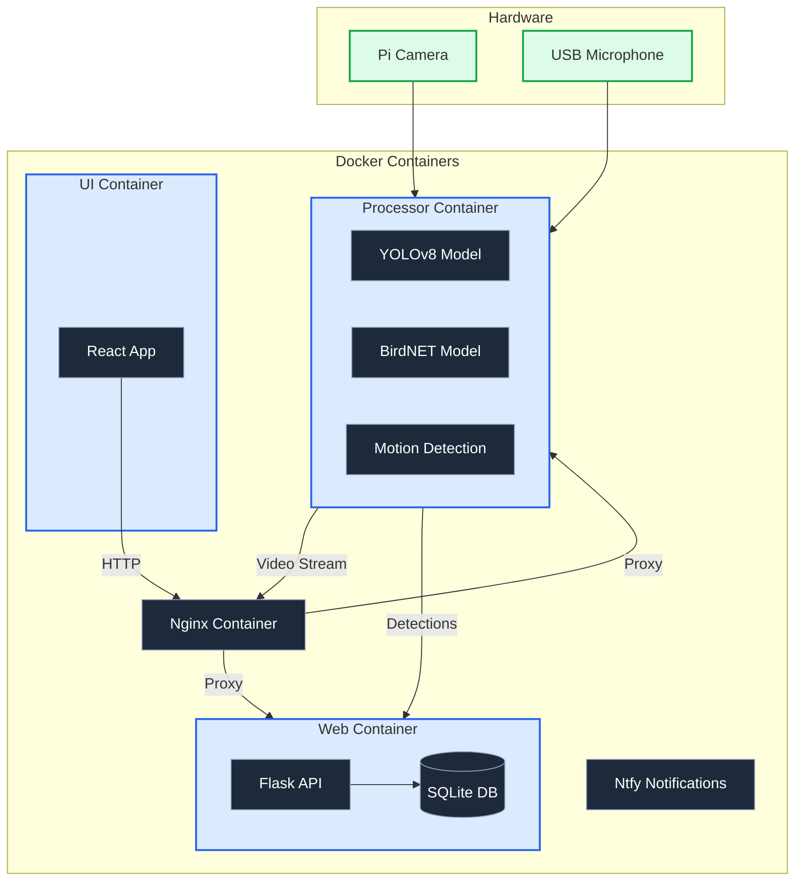

# Smart Bird Feeder

A Raspberry Pi-powered smart bird feeder that uses computer vision and audio recognition to detect, identify, and record birds. Built with Python, React, and runs entirely on local network using Docker.

## Features

- 🎥 Live video streaming
- 🦜 Real-time bird detection using custom-trained YOLOv8
- 🎤 Bird sound identification using [BirdNET](https://github.com/kahst/BirdNET-Analyzer)
- 📊 Visit tracking and statistics
- 📅 Timeline view of bird activities
- 📱 Modern Material UI mobile-friendly web interface
- 🌡️ Weather integration
- 🚫 No cloud dependencies, runs completely local

## System Architecture



## System Components

### Processor Container

- Handles video capture from Pi Camera
- Processes frames with YOLOv8 for bird detection
- Records audio and processes with BirdNET
- Streams MJPEG video for live view

### Web Container

- Flask API backend
- SQLite database
- Handles data storage and retrieval
- Processes bird visit analytics

### UI Container

- React-based web interface
- Material UI components
- Real-time data updates
- Mobile-friendly design

### Nginx Container

- Reverse proxy
- Serves static files
- Handles routing

### Notification Container

- Local notification service (ntfy)
- Alerts for bird detections

## Prerequisites

- Raspberry Pi 4B or 5, minimum 4GB of RAM
- Raspberry Pi Camera Module
- USB Microphone
- Raspberry Pi OS Lite (64-bit recommended)

## Quick Start

1. **Clone the repository:**

   ```bash
   git clone https://github.com/AleksandrRogachev94/BirdLense
   cd BirdLense/app
   ```

2. **Run the installation script:**

   ```bash
   chmod +x install.sh
   ./install.sh
   ```

3. **Start the application:**

   ```bash
   # Production mode:
   make build && make start

   # Development mode:
   make build-dev && make start-dev
   ```

In production mode, the app starts up automatically after rebooting. The web interface will be available at `http://birdlense.local`.

## Development

### Docker Setup

The project uses a multi-container structure:

- `docker-compose.base.yml`: Base configuration
- `docker-compose.dev.yml`: Development overrides
- `docker-compose.prod.yml`: Production settings

### Commands

```bash
# Build development containers
make build-dev

# Start development mode
make start-dev

# Stop containers
make stop-dev
```

### Directory Structure

```
smart-bird-feeder/
├── app_config/          # Configuration files
├── data/
│   ├── recordings/     # Video recordings and supporting files
├── processor/          # Video/audio processing
├── web/               # Flask API backend
├── ui/                # React frontend
└── nginx/             # Nginx configuration
```

## Contributing

1. Fork the repository
2. Create your feature branch (`git checkout -b feature/AmazingFeature`)
3. Commit your changes (`git commit -m 'Add some AmazingFeature'`)
4. Push to the branch (`git push origin feature/AmazingFeature`)
5. Open a Pull Request

## License

This project is licensed under the MIT License - see the [LICENSE](LICENSE) file for details.

## Acknowledgments

- [YOLOv8](https://github.com/ultralytics/ultralytics) for object detection base models
- [BirdNET-Analyzer](https://github.com/kahst/BirdNET-Analyzer) for bird sound identification
- [Material-UI](https://mui.com/) for the user interface components
