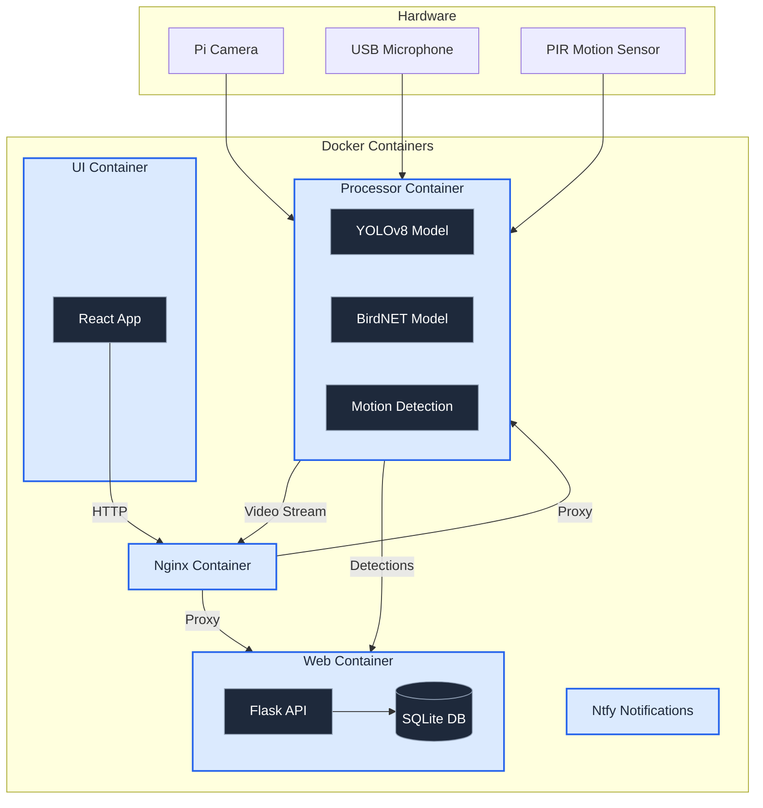

## Quick Start

1. **Clone the repository:**

   ```bash
   git clone https://github.com/AleksandrRogachev94/BirdLense
   cd BirdLense/app
   ```

2. **Run the installation script:**

   ```bash
   chmod +x install.sh
   ./install.sh
   ```

3. **Start the application:**

   ```bash
   # Production mode:
   make start
   make logs # optional, view logs to see if there are any errors

   # Development mode:
   make start-dev
   ```

The web interface will be available at `http://birdlense.local`. In production mode, the app starts up automatically after rebooting, so you are all set!

## Notifications Setup

The app comes with local ntfy notification server in a docker container, nothing gets shared outside of local network. To receive notifications on your smartphone, follow these steps:

1. **Install the ntfy app on your smartphone:**

- [Android](https://play.google.com/store/apps/details?id=io.heckel.ntfy)
- [iOS](https://apps.apple.com/app/ntfy/id1625396347)

2. **Configure the ntfy app:**

- Open the ntfy app on your smartphone.
- Add a new server with the following details:
  - **Host:** `http://birdlense.local:8081`
  - **Channel:** `birdlense`

For more information, visit the [ntfy website](https://ntfy.sh).

## Development

### Docker Setup

The project uses a multi-container structure:

- `docker-compose.base.yml`: Base configuration
- `docker-compose.dev.yml`: Development overrides
- `docker-compose.prod.yml`: Production settings

### Commands

```bash
# Build development containers
make build-dev

# Start development mode
make start-dev

# Stop containers
make stop-dev
```

### Directory Structure

```
smart-bird-feeder/
├── app_config/          # Configuration files
├── data/
│   ├── recordings/     # Video recordings and supporting files
├── processor/          # Video/audio processing
├── web/               # Flask API backend
├── ui/                # React frontend
└── nginx/             # Nginx configuration
```

## System Architecture



## System Components

### Processor Container

- Handles video capture from Pi Camera
- Processes frames with YOLOv8 for bird detection
- Records audio and processes with BirdNET
- Streams MJPEG video for live view

### Web Container

- Flask API backend
- SQLite database
- Handles data storage and retrieval
- Processes bird visit analytics

### UI Container

- React-based web interface
- Material UI components
- Real-time data updates
- Mobile-friendly design

### Nginx Container

- Reverse proxy
- Serves static files
- Handles routing

### Notification Container

- Local notification service (ntfy)
- Alerts for bird detections
